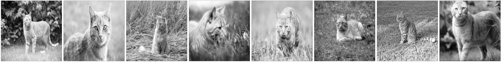
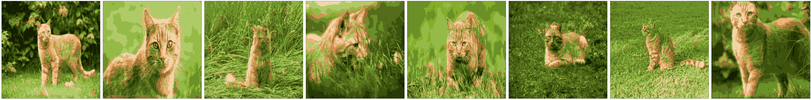
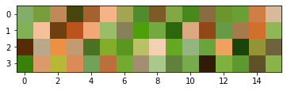
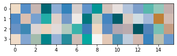
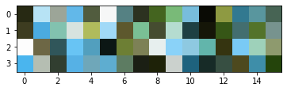
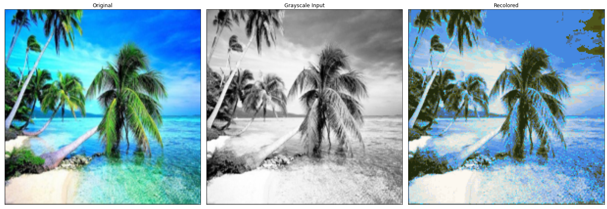
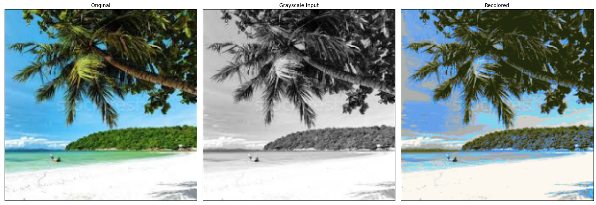
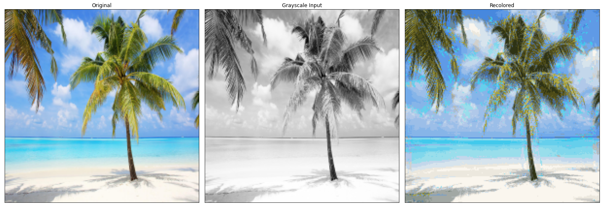
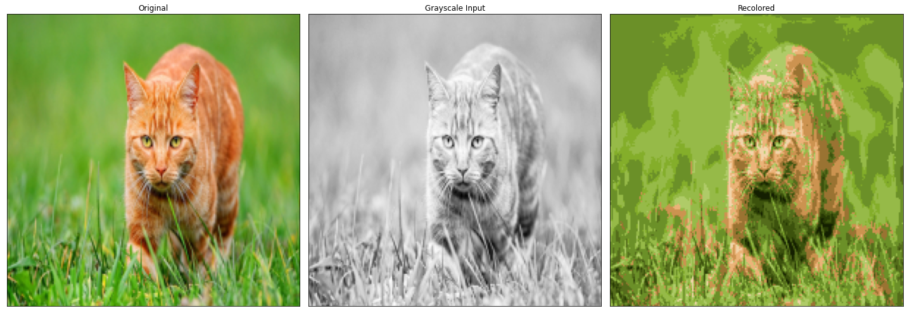
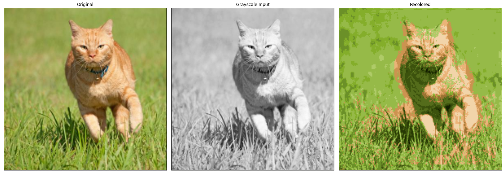

# image-colorizer

Deep neural networks for colorizing grayscale images.  Architectures for consideration include feed-forward multilayer perceptrons and basic convolutional neural networks.  Training was performed on AWS clusters and Google Colab.    

  



## Background  
This project aims to train a supervised learning model to add color to grayscale images.  To account for the limited scope of computing hardware and data available to me, I am considering only a reduced image domain.  Two datasets for consideration were images of a beach scene with palm trees and images of an orange cat in a grassy environment.  With this, my goal is to train a model that can capture features of the image and predict the color of pixels in that image (e.g. fur texture = orange, strandy texture = green grass).   
  

The RGB color value of a pixel is predicted using the spatial region surrounding the target pixel.  This is shown in the following image.  Note that the input to our model will be the grayscale values within the zeta-by-zeta window.  The output will be the RBG color value of the target pixel, t.   


## Restricting the prediction space with clustering    
Initially, the models we considered predicted a continuous output for RBG color values (0-255), and were thus regression problems.  However, for classes of problems like these, we found neural networks exhibit more stability if they were classification models.  We design a preprocessing stage in which a sample image from the dataset is used to derive a representative color set using k-means clustering.  The number of representative colors becomes a hyper-parameter--but it is limited to either 32 or 64 for consideration moving forward.  Future work would explore this parameter further.  


Below are examples of the representative color sets (ncolor=64) for the cat dataset, the beach dataset, and a palm tree dataset.  Each domain dataset will have its own representative color sets.   
  
  
  

Now, the input to our model is a zeta^2 window of grayscale values and the output becomes a ncolors dimensional vector.  This output vector will represent a probability space, so it will be produced by a softmax layer.   Further preprocessing over the dataset is needed to encode the RBG color values of pixels to representative colors in one-hot encoded form.  


## Basic Feed-forward Neural Network 

In this iteration, we explore basic feed-forward neural networks with window sizes between 5, 7, 12, and 15.  The architecture in consideration is shown below.  The performance of this model was fairly good.  The optimal value of hyper-parameters (e.g. ncolors, window size, model architecture) ranged greatly depending on the image domain.  

```python 
model = tf.keras.Sequential([ 
    Dense(200, input_shape=(w_size**2, ), activation='sigmoid'), 
    Dense(100, input_shape=(w_size**2, ), activation='sigmoid'), 
    Dense(50, activation='relu'), 
    Dense(n_colors, activation='softmax')
])
```

Test case for window size = 7


Test case for window size = 11.   



We see fairly reasonable coloring in these examples.  However, note that there are various regions of the images in which the model cannot relate the texture of the input window to the proper category of material.  Leaves of the palm trees are mistaken for ocean/sky blues.   


## Convolutional Neural Network 

Convolutional neural networks tend to perform better for tasks in which the spatial features of an input have strong predictive power.  In the case of image data, this is especially true.  We must slightly modify our data pipeline to not flatten the zeta-by-zeta input grid, but instead, maintain its dimension size of 2 (only 2 because it is a grayscale image).  The model will still make predictions on a set of ncolors just as before.   Just as with the feed-forward neural networks, the architecture is kept relatively simple.  The models are not very deep, but they are still able to capture meaningful features.  We found more success from further reducing the ncolors parameter to 16 for some iterations of the CNN.  


```python  
model = tf.keras.Sequential([ 
    Conv2D(10, kernel_size=(6, 6), padding='same', input_shape=(w_size, w_size, 1)), 
    Conv2D(20, kernel_size=(4, 4), padding='valid'), 
    Flatten(), 
    Dense(50, activation='relu'), 
    Dense(n_colors, activation='softmax')
])
```


We see significant improvement in model performance with the CNN as compared to the feed-forward network.  In addition to the improved performance, the model contains less weight parameters and is much easier to train (less time, epochs).  Although this DL model will essentially remain a black box, we can see from this improvement that the CNN model is better able to capture features of the image to predict color compared to the previous class of neural network models.   

Test cases for the CNN.  








## Future work
+ expand domain to include multiple categories of images (or no particular categories)    
+ larger dataset, leverage tf.Dataset pipelines   
+ apply transfer learning    